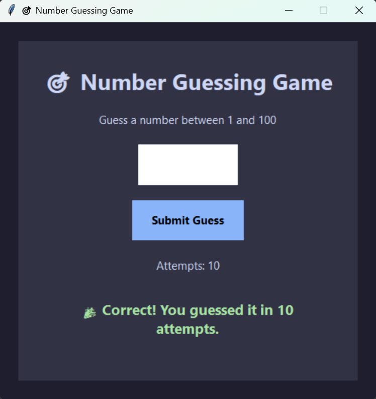

# Number Guessing Game

A simple and interactive Number Guessing Game built using Python and Tkinter. The player has to guess a randomly generated number between 1 and 100, with hints provided after each attempt.

## Features

* Random number generation between 1 and 100
* Modern dark-themed GUI using Tkinter
* Instant feedback for guesses:

  * Too High
  * Too Low
  * Correct Guess
* Attempt counter
* Input validation for invalid entries
* New Game button to restart the game
* Enter key support for quick submissions
* Clean and user-friendly interface

## Technologies Used

* Python
* Tkinter

## GitHub Repository

https://github.com/devanshu-dev0710/SCT_SE_2

## Project Structure

```text
SCT_SE_2
│
├── number_guessing_game.py
├── README.md
├── screenshots/
├── .gitignore
└── venv/
```

## How to Run

1. Clone the repository:

```bash
git clone https://github.com/devanshu-dev0710/SCT_SE_2.git
```

2. Navigate to the project folder:

```bash
cd SCT_SE_2
```

3. Run the application:

```bash
python number_guessing_game.py
```

## Screenshot



## Gameplay

1. Enter a number between 1 and 100.
2. Click **Submit Guess** or press **Enter**.
3. The game will tell you whether your guess is too high or too low.
4. Keep guessing until you find the correct number.
5. Use the **New Game** button to start a fresh game.

## Author

Devanshu
